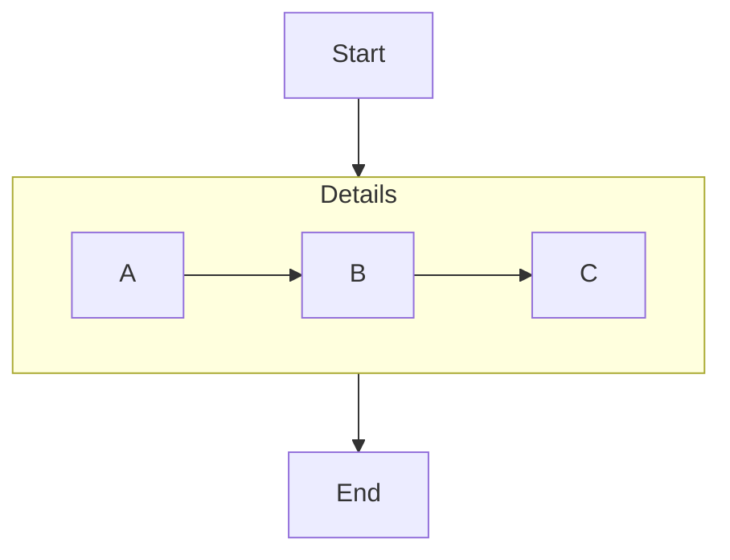
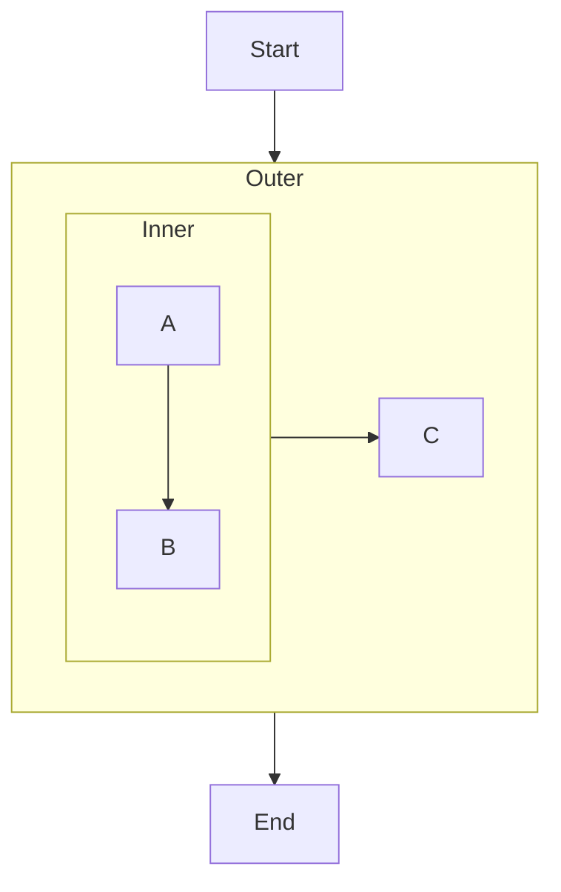
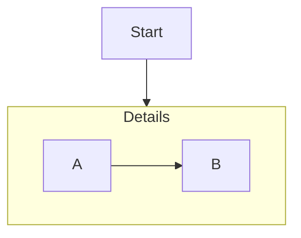

# Mermaid Subgraph Collapse — Examples & Spec

This doc is for a human to read top to bottom, in order. Start with the code. The "spec" at the end is just rules extracted from what you just saw — not the other way around.

## 1. A plain flowchart



Nothing new here. `mySub` is the subgraph's **id** (`Details` is just its display title). That id is going to matter for everything below — an unnamed subgraph (`subgraph Details` with no separate id, or a subgraph written as just a quoted title) can't be targeted by anything that follows.

## 2. Upstream mermaid already does static collapse — this needs no plugin

Add one line, and mermaid `>=11.17.0` renders `mySub` as a single compact node instead of expanding `A --> B --> C`:


This is real, existing mermaid syntax ([Flowcharts Syntax](https://mermaid.js.org/syntax/flowchart.html), shipped in [PR #7785](https://github.com/mermaid-js/mermaid/pull/7785)) — the author is declaring "start collapsed" at write time. Edges crossing `mySub`'s boundary (`Start --> mySub`, `mySub --> End`) redirect to the compact node; the edges entirely inside it (`A-->B`, `B-->C`) just aren't drawn. Nobody clicked anything — this is baked into the diagram source, same for every viewer, forever.

**Everything past this point is what this package adds on top.** Nothing above needed a plugin.

## 3. What the plugin adds: a viewer clicks, and it's remembered

```ts
import mermaid from 'mermaid';
import { renderCollapsible, createLocalStorageAdapter } from 'mermaid-collapse-state';

const authoredSource = `
flowchart TD
  Start --> mySub
  subgraph mySub["Details"]
    A --> B --> C
  end
  mySub --> End
`; // note: no @{ view: ... } line — nobody has decided anything yet

await renderCollapsible(document.getElementById('diagram'), authoredSource, {
  mermaid,
  adapter: createLocalStorageAdapter(),
});
```

First render: no stored state exists yet, so it renders exactly like §1 — fully expanded.

**A viewer clicks the "Details" subgraph.** Here's what actually happens, in order — this is the real output captured while testing this against mermaid `11.17.2` in a browser, not a hypothetical:

**a. This JSON gets written** (to `localStorage`, via the adapter):

```json
{
  "specVersion": "0.1",
  "diagramId": "hash:12o4ffl",
  "subgraphId": "mySub",
  "collapsed": true,
  "updatedAt": "2026-09-01T01:10:32.793Z",
  "viewerId": null,
  "source": "user"
}
```

**b. The library re-derives the text mermaid actually renders next** — same authored source from step 3, plus one appended line:

```
flowchart TD
  Start --> mySub
  subgraph mySub["Details"]
    A --> B --> C
  end
  mySub --> End
mySub@{ view: collapsed }
```

That's exactly §2's syntax — the plugin produced it, the viewer never saw or wrote mermaid syntax directly.

**c. `mermaid.render()` runs on that text.** `mySub` collapses to a single node, same as §2.

**Viewer clicks again** (now clicking the collapsed stand-in node) → a new JSON is written:

```json
{
  "specVersion": "0.1",
  "diagramId": "hash:12o4ffl",
  "subgraphId": "mySub",
  "collapsed": false,
  "updatedAt": "2026-09-01T01:10:33.794Z",
  "viewerId": null,
  "source": "user"
}
```

→ next render's appended line becomes `mySub@{ view: expanded }` → subgraph is back.

**Reload the page** → the stored JSON is still there → first render already picks it up → whatever state the viewer left it in is what they see again.

## 4. Rules this example implies

Each of these is just naming something you already saw above.

- **A subgraph needs an explicit id to be collapsible-by-a-click at all** — that's `mySub` in §1. This isn't a plugin limitation, it's inherited straight from upstream's `id@{ view: ... }` syntax in §2.
- **The diagram's identity (`diagramId`) is computed from the §3 authored source — before step (b)'s rewrite, never after.** That's why clicking never changes `diagramId`: `hash:12o4ffl` is the same in both JSON blobs above. (Code: [identity.ts](src/identity.ts). If you compute it from the *rewritten* text instead, every toggle would look like a different diagram and state would never be found again on the next click — this is the one mistake that breaks everything else.)
- **Collapse state lives outside the diagram text, full stop.** You will never find `"collapsed": true` anywhere inside a `.mmd` file — it only exists in whatever the adapter is backed by (`localStorage` in this example). The authored source in step 3 is identical before and after every click.
- **The rewrite replaces, never appends, a second `@{ view: ... }` line for the same id.** If the diagram already had an authored `mySub@{ view: expanded }` line, clicking to collapse it would edit that line in place, not add a second, conflicting statement for `mySub`. (Code: [rewrite.ts](src/rewrite.ts) — see the "replaces an existing metadata line" test.)
- **No stored state = fall back to whatever §1/§2 already said.** If the author already wrote `view: collapsed` and nobody has clicked yet, it renders collapsed — the plugin doesn't silently override an author's explicit default. And if *nobody* said anything, it's expanded — see §6.1, which makes that a hard guarantee rather than an incidental behavior.

## 5. Nested subgraphs

Yes, these happen — a subgraph can contain another subgraph, and each level needs its own independent collapse state. Tested live against mermaid `11.17.2`, not assumed:



Rendering all four combinations of `outer@{ view: ... }` / `inner@{ view: ... }` — real output, captured by calling `mermaid.render()` directly and inspecting the SVG:

| `outer` | `inner` | result |
|---|---|---|
| expanded | expanded | both render as `<g class="cluster">` — normal nested rendering |
| **collapsed** | expanded | zero `.cluster` elements at all — `inner` disappears along with everything else inside `outer`. No error. |
| expanded | **collapsed** | `outer` still renders as `<g class="cluster">`; `inner` renders as `<g class="node">` (a plain node, not a cluster) sitting where the subgraph used to be; `A`/`B` are gone, `C` (outside `inner`, inside `outer`) is untouched. |
| **collapsed** | **collapsed** | identical output to "collapsed / expanded" above — `outer` collapsing wins, `inner`'s own state has no visible effect while it's buried inside a collapsed ancestor. Still no error from having both metadata lines present at once. |

**This means the "what happens when both are collapsed" question isn't actually open — mermaid core already has a definite, testable answer (outermost collapsed ancestor wins), and nothing about our state model needs to know that rule exists.** `applyOverrides` just emits whichever `@{ view: ... }` lines have stored overrides, for however many subgraphs, at however much nesting — mermaid composes them. Zero extra logic required. (This replaces an earlier, more hedgy note in this doc that treated this as unverified — it's been run now.)

**Click targeting also needed no changes, for a reason that wasn't obvious going in:** mermaid does *not* nest `inner`'s `<g>` inside `outer`'s `<g>` in the DOM, even though it's visually inside it — `outerEl.contains(innerEl)` is `false`; they're siblings, positioned by coordinates. That initially looks like it'd break `resolveClickedSubgraphId`'s "walk up from the click target" approach, but it doesn't: `inner`'s own label/rect are still children of `inner`'s own `<g id="...-inner">`, so a click there hits that `<g>` first while walking up, before it could ever reach a sibling. Clicking `inner` resolves to `inner`; clicking `outer`'s own boundary (not on `inner`) resolves to `outer`. No crosstalk, verified, no code changes needed.

What's genuinely still open after this:
- Only 2 levels of nesting have been tested — not 3+.
- Id-substring collision gets a little more likely to bite as diagrams grow more subgraphs (e.g. an id `sub` is a substring of a sibling id `subOuter`) — this was already a latent risk in `resolveClickedSubgraphId`'s `.includes()` check before nesting entered the picture; nesting doesn't introduce it so much as give you more ids to accidentally collide.
- No "collapse all" / "expand all" convenience — right now toggling is strictly one subgraph at a time, however deep. A cascading helper would be new code on top of what exists, not something nesting forces.

## 6. Backward compatibility (non-negotiable)

Two hard rules. Both are enforced by tests in [test/resolve.test.ts](test/resolve.test.ts), so they break loudly rather than quietly.

### 6.1 Unspecified means EXPANDED, never collapsed



Nobody has authored a `view:` line. Nobody has clicked. **This must render fully expanded** — exactly as it did before this package, or mermaid's collapse feature, existed. "No information" is never an excuse to hide someone's diagram contents.

Concretely, in resolution order (code: [resolve.ts](src/resolve.ts)):

| stored state | authored `@{ view: ... }` | result |
|---|---|---|
| `collapsed: true` | anything | collapsed |
| `collapsed: false` | anything | expanded |
| none | `collapsed` | collapsed (author's default, §4's last rule) |
| none | `expanded` | expanded |
| **none** | **none** | **expanded** ← the compatibility default |

The corollary matters just as much: with no stored state, `applyOverrides` returns the authored source **byte-identical**, so a diagram that has never been clicked is handed to `mermaid.render()` completely untouched. Adding this package to a page cannot change how any existing diagram looks.

### 6.2 Everything stays valid mermaid 11.17.0 syntax

This package defines no syntax of its own. It reads and writes exactly the `id@{ view: collapsed | expanded }` statement that mermaid `11.17.0` shipped (§2) — nothing more.

That gives three properties worth stating explicitly:

- **Diagrams written for 11.17.0 work here unchanged.** An authored `mySub@{ view: collapsed }` is respected as the starting state, not overwritten or ignored.
- **What this package generates is plain vanilla mermaid.** The "effective source" from §3(b) can be copied into mermaid.live, a GitHub code fence, or any other 11.17.0+ renderer and produces the same picture. There is no dialect, no superset, no preprocessing step anyone else has to replicate.
- **The state store holds no syntax.** It holds booleans keyed by ids (§3(a)). Delete the entire state store and every diagram falls back to §6.1 — still renders, just without anyone's remembered choices.

The `id:` frontmatter field from "Reference → Diagram identity" is optional and additive: a diagram without it gets a content hash instead, so no existing diagram needs editing to work with this.

## 7. Reference (for implementing against this, not for reading first)

If you're building a second implementation of this contract (e.g. a native, incrementally-relaid-out renderer instead of this package's full-rewrite approach) — match these, and diagrams/state stay portable between the two. If you're just using the package, you don't need this section; §1–4 already told you everything that matters.

### Diagram identity

Priority order:
1. YAML frontmatter `id:` field, if present, used verbatim.
2. Otherwise, a hash of the authored source (§3's rule above — pre-rewrite, always).

### State object schema

```ts
interface CollapseState {
  specVersion: '0.1';
  diagramId: string;    // §3 rule
  subgraphId: string;   // must match an id from the diagram, e.g. "mySub"
  collapsed: boolean;
  updatedAt: string;    // ISO 8601
  viewerId?: string | null; // null/omitted = shared/global state, not per-viewer
  source: 'user' | 'default'; // "user" = explicit click, "default" = author's initial view: value
}
```

### Storage adapter interface

```ts
interface CollapseStateAdapter {
  get(diagramId: string, subgraphId: string, viewerId?: string): Promise<CollapseState | null>;
  set(state: CollapseState): Promise<void>;
  list(diagramId: string, viewerId?: string): Promise<CollapseState[]>;
  subscribe?(diagramId: string, cb: (state: CollapseState) => void): () => void; // optional; for future live multi-viewer sync
}
```

v0.1 ships `createLocalStorageAdapter()` (used above) and `createMemoryAdapter()` (tests/SSR). A server-backed adapter for state shared across viewers is additive later — nothing here needs to change to add one.

### Event contract

Dispatched on the render container as `CustomEvent`s, namespaced `mermaid-collapse:*` specifically so a future native implementation can emit the same events and existing listeners don't need to change:

- `mermaid-collapse:toggle` — fired before the state write, `detail: { diagramId, subgraphId, nextCollapsed }`. A host app can listen and veto (e.g. `event.preventDefault()` — not currently checked by this package, but reserved).
- `mermaid-collapse:change` — fired after re-render completes, `detail: { diagramId, subgraphId, collapsed }`.

### Where a text-rewrite implementation (this package) and a hypothetical native one would differ

Both must match everything above. They differ only in how a stored override becomes a rendered diagram:

| | this package (v0.1) | hypothetical native kernel |
|---|---|---|
| Mechanism | inject/replace `@{ view: ... }` lines in text, full `mermaid.render()` | mutate an internal graph object, re-layout only the affected subtree |
| Cost per toggle | full reparse + layout + redraw | incremental |
| Animation | none | possible (positions known before/after) |

### Open questions before calling any of this v1.0

- Does mermaid's parser tolerate two `id@{...}` statements for the same id (later wins), or error? §4's "replace, don't append" rule sidesteps needing to know — but it's still unconfirmed which way mermaid actually behaves.
- Is a non-cryptographic hash for `diagramId` (see identity.ts) good enough long-term, given the only failure mode of a collision is a wrong remembered collapse state, not a security issue?

### Non-goals for v0.1

- Diagram types other than flowchart (no analogous `view:` primitive upstream for sequence/state/mindmap yet).
- Nesting beyond 2 levels deep — see §5, tested only to 2. The composition rule itself (outermost collapsed ancestor wins) is confirmed, matches [Discussion #6377](https://github.com/orgs/mermaid-js/discussions/6377), and needed no special-case code.
- Animated transitions.
- Multi-viewer live sync (the `subscribe` hook exists for this later; unimplemented in v0.1's shipped adapters).
